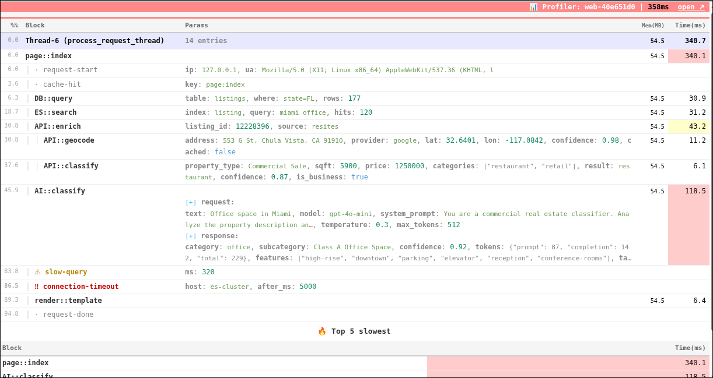
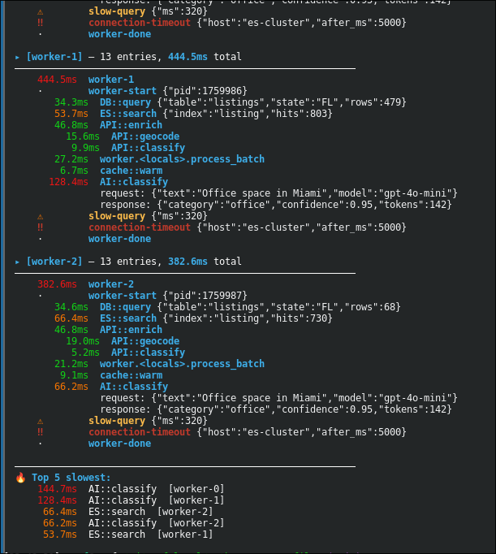
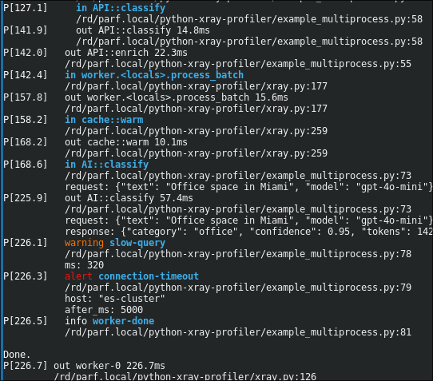

# Python XRay Profiler

See through your code. Lightweight execution profiler for Python.

Version: `0.4.0`

Author: Serg Parf <sergey.porfiriev@gmail.com>



### What it does

Xray traces function calls, measures timing, tracks memory, and captures parameters —
then renders a Call Tree showing exactly what happened, how long each step took,
and where the bottlenecks are.

### Zero-touch instrumentation

Xray can profile existing code without modifying a single line of source.
Use `Xray.patch()` to inject profiling into any third-party library, framework,
or legacy class at runtime — database drivers, HTTP clients, ORM models,
API wrappers. Just call `Xray.patch(SomeClass, 'method')` at startup and
every call to that method is automatically traced with timing, call site,
and parameters. No decorators, no context managers, no refactoring needed.

### Key features

- decorator (method): `@Xray.profile()` — auto-profile a function
- decorator (method): `@Xray.profile('name')` — with custom name
- decorator (class): `@Xray.trace_class()` — auto-profile all public methods
- decorator (class): `@Xray.trace_class(methods=['find'])` — specific methods only
- runtime patch: `Xray.patch(AnyClass, 'method')` — instrument existing code without changes
- `Xray.info()` / `warning()` / `alert()` — events, checkpoints, error markers
- **Multi-worker** — Redis-backed, thread-safe; multiple processes share one execution trace
- **Zero overhead** — disabled Xray returns no-op objects, no `if` guards needed

### Reporting

- **Web** — auto-injected HTML panel with Call Tree table, typed params, expand/collapse, color-coded timing, warning/alert badges, and compact Gantt-like Coverage map
- **JSON** — `/_profiler/json?k=KEY` endpoint returns raw entries as JSON
- **CLI** — `Xray.report()` prints color-coded tree grouped by worker with Top 5 slowest
- **CLI instant** — real-time stderr with nested outline, shows every `in`/`out` as it happens

## Quick Start

```python
from xray import Xray
import redis

# If you want profiling:
Xray.init(redis.Redis(host='redis'))  # task_id auto-generated

# If you do not want profiling:
Xray.init(False)  # disabled mode

# In disabled mode, Xray.i(), decorators, and patched methods become no-ops.
# Overhead = ZERO, so instrumentation can stay in the code.

# In enabled mode, overhead is minimal.
with Xray.i('ES::search', {'query': q}):
    results = es.search(q)
    # work happens as usual; data is recorded only when profiling is enabled
```

## Spans (with duration)

```python
# Context manager — recommended
with Xray.i('section-name', {'key': 'val'}) as span:
    result = do_work()
    span.data({'rows': len(result)})   # add data mid-execution

# Auto-name from caller (Class.method)
with Xray.i() as span:
    ...
```

When profiler is disabled, `Xray.i()` returns a no-op — safe to use without checks.

## Decorator

```python
@Xray.profile()                    # auto-name: Class.method
def find_listings(params): ...

@Xray.profile('custom-name')       # explicit name
def helper(): ...
```

## Class Decorator

Auto-profile all (or specific) methods of a class. Each call creates a span
named `ClassName.method_name`. Private methods (`_name`) are skipped by default.

```python
# All public methods — every call to find/enrich/save is auto-profiled
@Xray.trace_class()
class SearchService:
    def find(self, q): ...           # → span "SearchService.find"
    def enrich(self, data): ...      # → span "SearchService.enrich"
    def save(self, item): ...        # → span "SearchService.save"
    def _internal(self): ...         # skipped (private)

# Specific methods only
@Xray.trace_class(methods=['find', 'save'])
class SearchService:
    def find(self, q): ...           # profiled
    def save(self, item): ...        # profiled
    def enrich(self, data): ...      # NOT profiled

# Include private methods too
@Xray.trace_class(skip_private=False)
class Service:
    def run(self): ...               # profiled
    def _setup(self): ...            # profiled (skip_private=False)
```

Useful for instrumenting service classes, repositories, and API clients
without adding `with Xray.i()` to every method.

## Runtime Patching

Inject profiling into any existing class at runtime — no source changes required.
Works on third-party libraries, framework internals, legacy code.

```python
from elasticsearch import Elasticsearch
from myapp.db import DatabasePool
from myapp.cache import RedisCache

# Single method
Xray.patch(Elasticsearch, 'search')

# Multiple methods
Xray.patch(Elasticsearch, ['search', 'index', 'delete'])

# All public methods
Xray.patch(DatabasePool)
Xray.patch(RedisCache)
```

Call `Xray.patch()` once at application startup. Every subsequent call to the
patched methods is automatically profiled — no changes to the original code.

## Closure Wrapper

```python
result = Xray.wrap(lambda: api_call(url), 'API::call', {'url': url})
```

## Info Points (no duration)

```python
Xray.info('cache-hit', {'key': k})
Xray.warning('rate-limit', {'remaining': 5})
Xray.alert('timeout', {'url': url, 'after_ms': 5000})
```

## Setup

```python
# Redis mode — store entries, read report later
Xray.init(redis_client)                          # task_id auto-generated
Xray.init(redis_client, 'my-task-123')           # explicit task_id
Xray.init(redis_client, thread_id='worker-1')    # explicit thread_id
Xray.init(False)                                 # disabled mode (zero overhead)

# Access current task_id
print(Xray.task_id())                            # 'xray-a1b2c3d4' or 'my-task-123'

# Instant mode — real-time stderr output
Xray.init_instant()

# Close + disable
Xray.finish()                                    # close root span (also called by atexit)
Xray.disable()                                   # finish + disable
```

`task_id` auto-generates as `xray-{8 hex chars}` when not provided.
`thread_id` defaults to `threading.current_thread().name`.

## Reading Results

```python
# CLI report (color-coded, grouped by worker)
Xray.report()                      # current task
Xray.report('other-task-id')       # specific task

# HTML report (Call Tree table)
html = Xray.html_report()          # returns HTML string

# Semver version
print(Xray.VERSION)                # '0.4.0'

# JSON (sorted entries + summary stats)
data = Xray.json()                 # {'task_id', 'total_ms', 'entries', 'spans', 'warnings', 'alerts', 'data': [...]}

# Raw entries (unsorted, as stored in Redis)
entries = Xray.entries()            # list of dicts
```

## Multi-Process / Celery

Each worker calls `Xray.init()` with the same `task_id` but different `thread_id`.
Redis RPUSH is atomic — no conflicts.

```python
# Worker 1
Xray.init(r, 'job-abc', thread_id='w1')

# Worker 2
Xray.init(r, 'job-abc', thread_id='w2')
```

Report groups entries by `thread_id` automatically.

## Instant Mode

Real-time stderr output with nested outline — no Redis needed:

```python
Xray.init_instant()

with Xray.i('DB::query', {'table': 'users'}):
    ...
```

Output:
```
P[0.0] init instant
P[0.1] in DB::query
         app/db.py:45
         table: "users"
P[15.3] out DB::query 15.2ms
         app/db.py:45
         table: "users"
         rows: 150
```

Nested spans are indented. `in` lines are bold, `out` lines are dimmed.

## Examples

### CLI (multiprocess)

```bash
python3 example_multiprocess.py --default    # 3 workers + Redis report
python3 example_multiprocess.py --instant    # real-time stderr output
```

Grouped CLI report:



Instant stderr output:



### Web (Flask)

```bash
pip3 install flask redis
python3 example_web.py
```

Open http://localhost:5000/ — auto-profiled page with execution panel at the bottom.

| URL | Description |
|-----|-------------|
| `/` | Single-process demo with DB, ES, API, AI calls |
| `/threaded` | Multi-worker demo (two iframe workers share task-id) |
| `/api/search?q=miami` | JSON API (profiler key in `X-Xray-Key` header) |
| `/_profiler?k=KEY` | Standalone HTML report |
| `/_profiler/json?k=KEY` | Raw JSON entries |

## Attach Profiler To Response

Use `Xray.attach_profiler()` in web middleware to automatically add a collapsible profiler panel at the bottom of the page, while keeping the response integration inside the library.

Example:

```python
@app.before_request
def start_profiler():
    # ON/OFF logic example:
    # if request.args.get('xray') == '1':  # turn ON for developers
    #     Xray.init(redis_client)  # task_id auto-generated
    # else:  # turn OFF for visitors
    #     Xray.init(False)
    #
    if request.path in ('/_profiler', '/_profiler/json', '/worker'):
        request.environ['xray_attach_profiler'] = False
        Xray.init(False)  # explicit no-op init for requests that should not attach profiler UI
        return
    request.environ['xray_attach_profiler'] = True
    Xray.init(redis_client)  # task_id auto-generated

@app.after_request
def attach_profiler(response):
    if not request.environ.get('xray_attach_profiler', True):
        return response
    return Xray.attach_profiler(
        response,
        endpoint='/_profiler',
    )
```

This keeps web integration minimal and moves profiler response handling into the library.

The profiler panel fetches its HTML from a standalone endpoint:

```python
@app.route('/_profiler')
def profiler_view():
    task_id = request.args.get('k', '')
    if not task_id:
        return 'Missing ?k= parameter', 400
    Xray._redis = redis_client
    return Xray.html_report(task_id)
```

## See Also

- [internals.md](internals.md) — Redis format, entry structure, implementation details
